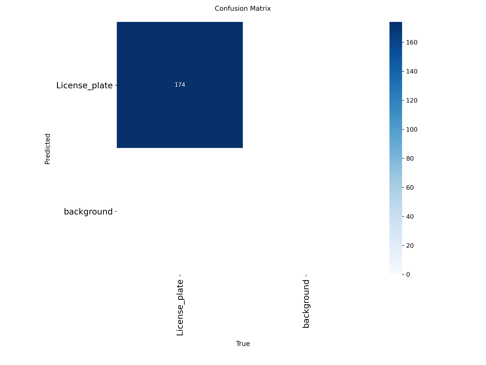
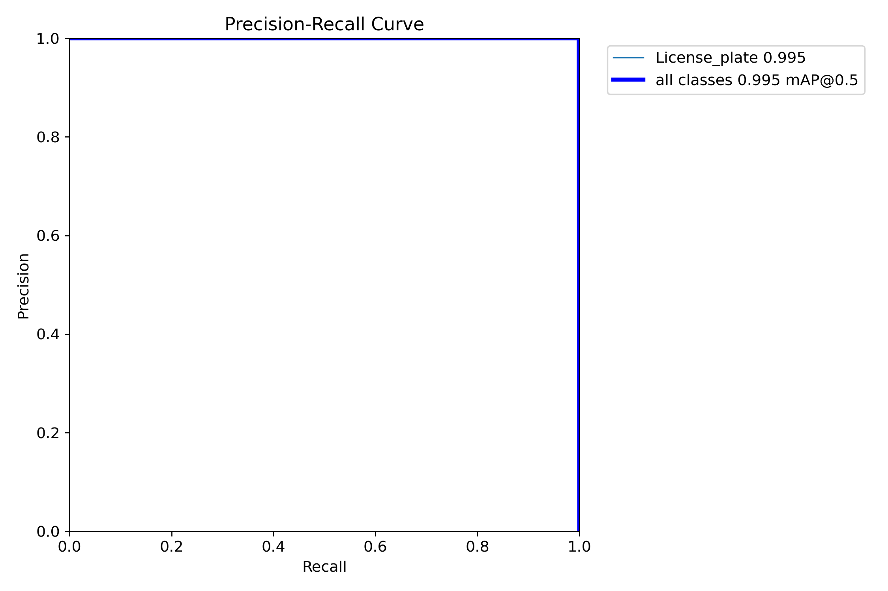
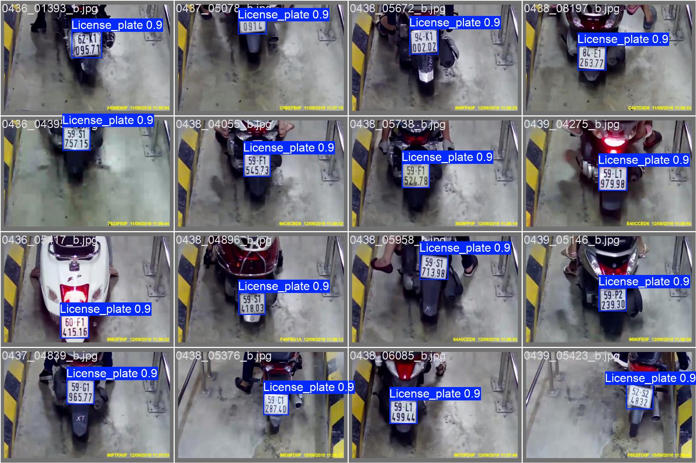
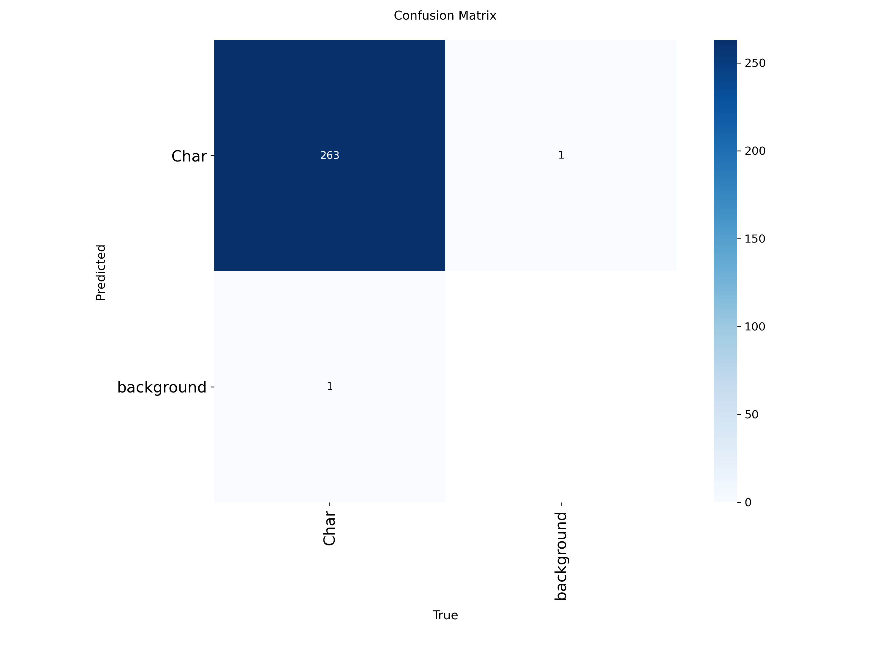
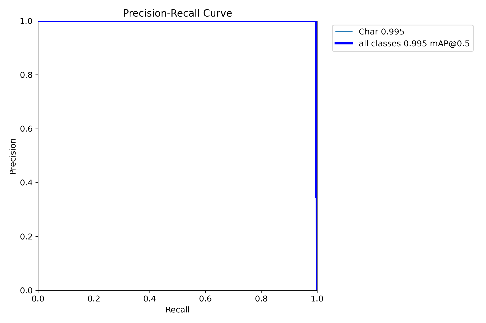
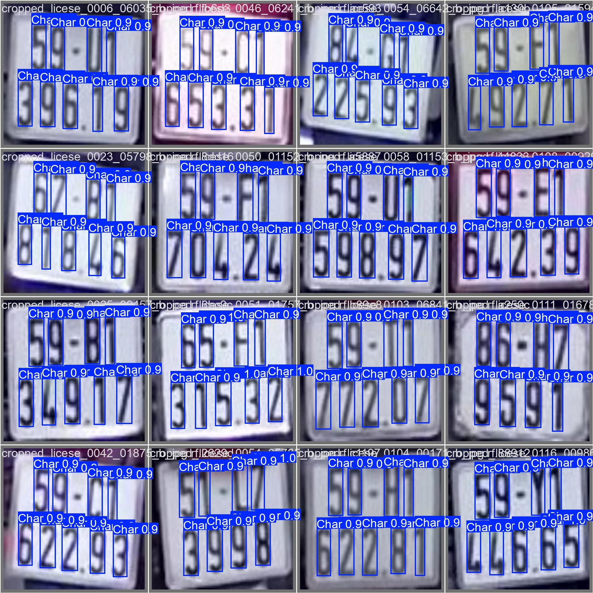

 <h1 align="center">License Plate Recognition</h1>

## Giới thiệu

  Sử dụng BA model tạo thành một PIPELINE xử lý từ ảnh đầu vào model đầu tiên là YOLO11n cắt ra object là biển số xe.
  Tiếp theo model thứ hai cắt ra các đối tượng bên trong biển số xe là các ký tự ABC 1234 ... trên biển số. Model cuối 
  cùng được huấn luyện trên bộ dữ liệu này sẽ thực hiện phân tích và phán đoán xem ký tự này là tý tự nào.
  Trên bộ dữ liệu ảnh chụp xe hạn chế và số lượng nhãn hạn chế nên model có một vài trường hợp sẽ không chính xác nếu 
  có nhiều dữ liệu được đánh nhãn hơn thì model sẽ cho ra kết quả tốt hơn thay vì dữ liệu train cho model đầu tiên 1399 mẫu, 
  model thứ hai chỉ có 521 mẫu và model cuối cùng chỉ có 229 mẫu cho mỗi ký tự từ 0 đến 9 và từ A đến Z

## Kết quả

<table align="center">
  <tr>
    <td align="center" width="45%">
       
    </td>
    <td align="center" width="45%">
       
    </td>
  </tr>
</table>

<table align="center">
  <tr>
    <td align="center" width="45%">
       
    </td>
    <td align="center" width="45%">
       
    </td>
  </tr>
</table>

<table align="center">
  <tr>
    <td align="center" width="45%">
       
    </td>
    <td align="center" width="45%">
       
    </td>
  </tr>
</table>

<table align="center">
  <tr>
    <td align="center" width="45%">
       
    </td>
    <td align="center" width="45%">
       
    </td>
  </tr>
</table>

## Model Dectection License Plate được train với tập dữ liệu được đánh nhãn

<table align="center">
  <tr>
    <td align="center" width="45%">
       
      <em>confusion matrix</em>
    </td>
    <td align="center" width="45%">
       
      <em>BoxPR_curve</em>
    </td>
  </tr>
</table>

mô hình đạt 99.5% độ chính xác trung bình khi tính tại ngưỡng IoU = 0.5

  

## Model OCR được train với tập dữ liệu được đánh nhãn

<table align="center">
  <tr>
    <td align="center" width="45%">
       
      <em>confusion matrix</em>
    </td>
    <td align="center" width="45%">
       
      <em>BoxPR_curve</em>
    </td>
  </tr>
</table>

mô hình đạt 99.5% độ chính xác trung bình khi tính tại ngưỡng IoU = 0.5

  

## Nhận xét

  Model nhỏ nhẹ với một lượng dữ liệu ít tuy nhiên model vẫn cho một kết quả tốt với các mẫu dữ liệu test với tỉ lệ dự đoán đúng lên tới 98% tuy nhiên có 
  một vài trường hợp bị nhận diện thành nhiều hơn số lượng ký tự thực có trong quy định biển só tuy nhiên không đáng lo ngại có thể dùng một vài logic để khắc phục nó.

  Có thể thử tải về và chạy thử nó trên UBUNTU
  
  BASH: xhost +local:root
  
  BASH: docker run -it \
    --rm \
    -e DISPLAY=$DISPLAY \
    -v /tmp/.X11-unix:/tmp/.X11-unix \
    bien_so
